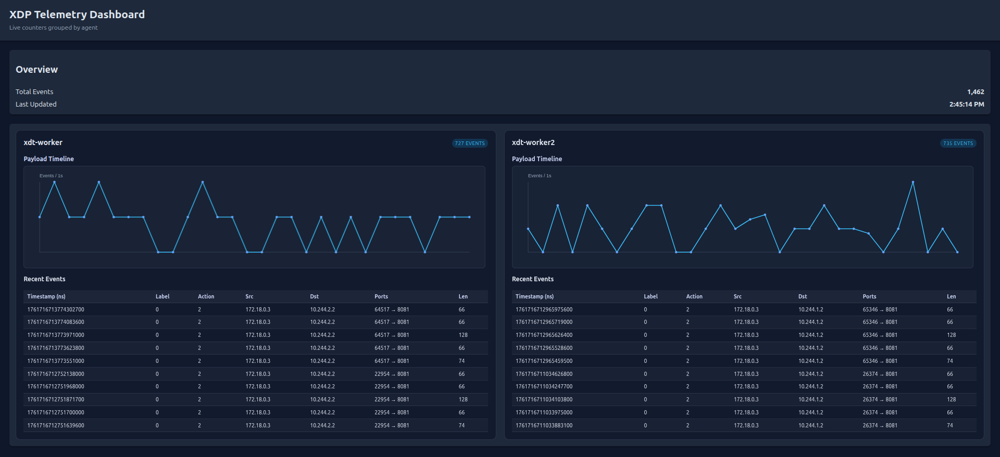

# XDP Telemetry (PoC)

This repository contains a monorepo PoC that applies XDP/eBPF to label packets, mirrors telemetry via a BPF ring buffer, and streams metadata to a central telemetry server with a lightweight UI. The project is organised as modular components so it can later be split into separate services if needed.

## Components

- **xdp/** — eBPF program (`xdp/bpf/xdp.bpf.c`) and user-space helpers (`xdp/lib/xdp_telemetry.c`, headers under `xdp/include/`).
- **agent/** — `xdt-agent` binary. Attaches to the pinned maps, receives events via the BPF ring buffer, and streams telemetry records over a length-prefixed TCP channel to the central server. Command-line options are parsed inline with the shared params helper.
- **central/** — Telemetry server. Accepts the length-prefixed telemetry frames, keeps in-memory statistics per agent, exposes `/metrics.json`, and serves the dashboard UI under `central/ui/static/`.
- **service/** — Minimal HTTP health server that listens on `/healthz`; acts as a placeholder for the protected business application.
- **xdt/** — `xdt` CLI tool for attach/detach, rule management, and debugging (uses the shared library under `xdp/`).
- **common/** — Shared telemetry encoder/decoder (`common/telemetry`) and command-line parser (`common/cli`), used by agent and CLI.

## Kubernetes Sample (kind)

The helper script under `scripts/kind-up.sh` creates a three-node kind cluster (control-plane + 2 workers), builds and loads the local container images, and deploys the CLI pod, agent daemonset, central deployment/service, and sample service in a single step. Central runs on the control-plane node; agent and service run on both workers.

```bash
make kind-up              # creates cluster + deploys everything
kubectl get pods -o wide  # verify xdt-cli, xdt-agent, xdt-central, xdt-service
```

- Topology: `xdt-control-plane` hosts `xdt-central`; `xdt-worker` and `xdt-worker2` host `xdt-agent` and `xdt-service`.
- Scheduling: workers are labeled `xdt-telemetry=true` at bring-up; `xdt-agent` DaemonSet selects that label; `xdt-service` has `replicas: 2` plus `podAntiAffinity` to ensure one Pod per worker; `xdt-central` is pinned to control-plane with tolerations for control-plane taints.
- Access: telemetry UI at `http://127.0.0.1:8090/`, sample service at `http://127.0.0.1:8091/` (host ports map to NodePorts).
- Note: host ports default to 8090/8091; ensure they are free before `make kind-up`.
- Tear down the environment with:
  ```bash
  make kind-down
  ```

## Packet Interception (Service Pod veth)

The agent intercepts only traffic destined to the service Pod by attaching the XDP program to the Pod’s veth (its `eth0` inside the Pod network namespace). Packet metadata is mirrored via a kernel ring buffer and streamed to the central service.

- Scope: Captures ingress traffic on the service Pod interface (`eth0` in the Pod netns). Unrelated node traffic (e.g., kubelet↔apiserver, central:50051, UI:8080) is excluded, so counters reflect service traffic only.
- Attach flow (kind): The DaemonSet agent resolves the service Pod sandbox PID via `crictl` (containerd CRI socket), temporarily enters the Pod netns with `setns(CLONE_NEWNET)`, attaches XDP to `eth0` inside that netns, then returns to the host netns to establish the TCP connection to the central.
- Requirements: `hostPID: true` (access to `/proc/<pid>/ns/net`), privileged + bpffs (`/sys/fs/bpf`), read-only mount of `/run/containerd/containerd.sock`, and `crictl`/`jq` available in the image.

## Telemetry UI

- `/metrics.json` returns `{ total_events, nodes: [ { agent_id, total_events, label_counts[], recent_events[] } ] }`.
- The UI (served at `/`) fetches JSON every second, renders per-agent bar charts (label distribution), a timeline chart (payload size vs timestamp), and a table of recent events.

